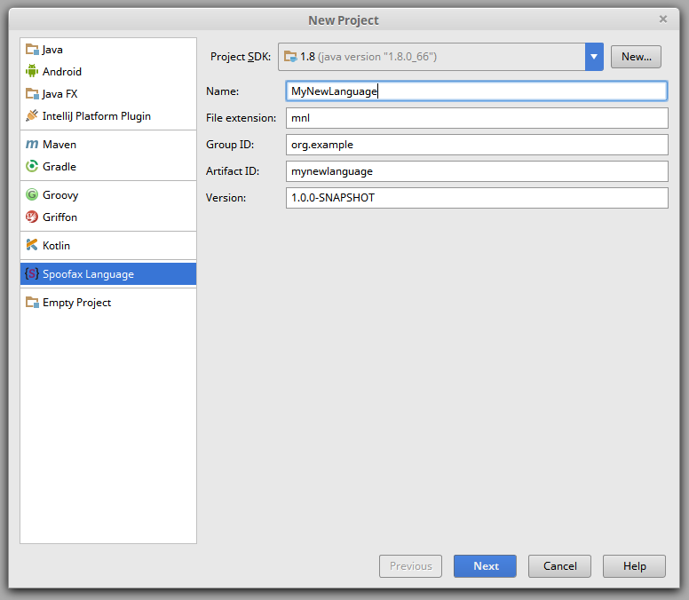

[](http://buildfarm.metaborg.org/job/spoofax-intellij/)
[](./LICENSE.md)

# Spoofax plugin for IntelliJ IDEA


Develop and use languages with the [Spoofax Language Workbench](http://www.spoofax.org/) in IntelliJ IDEA.

Want to learn more? [See the wiki](https://github.com/metaborg/spoofax-intellij/wiki).

## Quick Start

Install the plugin.

Create a new Spoofax language specification by going to the _File_
→ _New_ → _Project_ menu, and selecting _Spoofax Language_.
Finish the wizard. Go to [the Spoofax website](http://www.spoofax.org/)
for more information.




## Development

### Run

Run this plugin in a sandbox IntelliJ IDEA instance using

```
gradle runIdea
```

or run the _IntelliJ Plugin_ configuration from IntelliJ.


### Debug

Debug the JPS plugin using 

```
gradle debugIdea
```

or run the _IntelliJ Plugin (Debug JPS)_ configuration from IntelliJ.
Then connect a debugger to port 5005, or debug the _JPS Plugin_
configuration from IntelliJ.


### Test

Run the tests using

```
gradle check
```

or run the _Unit Tests_ configuration from IntelliJ.


### Deploy

To deploy the plugin, click the _Build_ → _Prepare All Plugin Modules
For Deployment_ menu.
